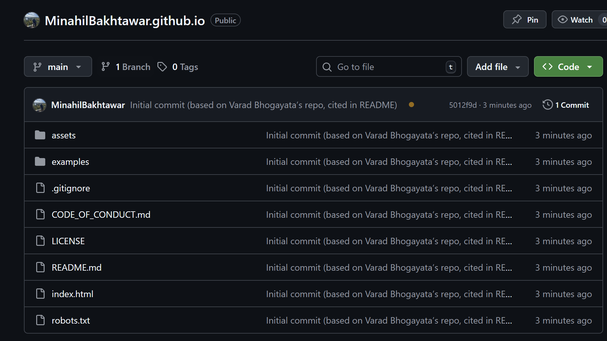
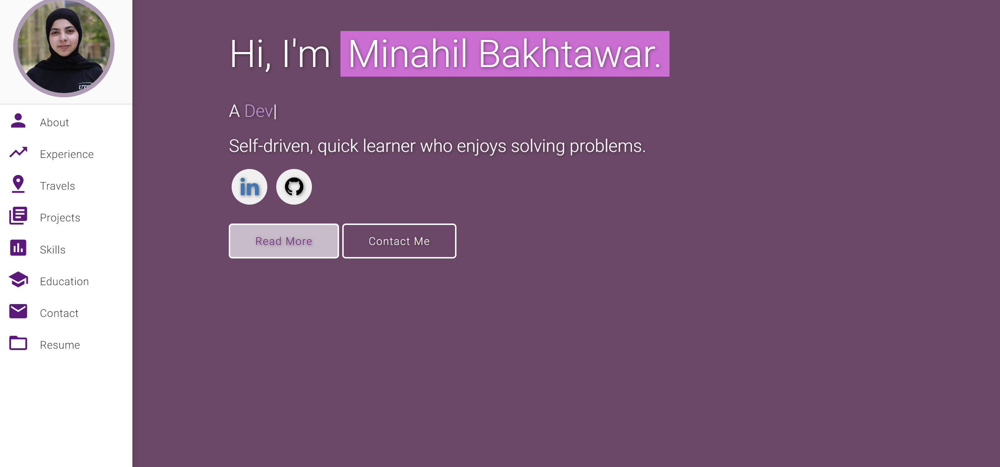
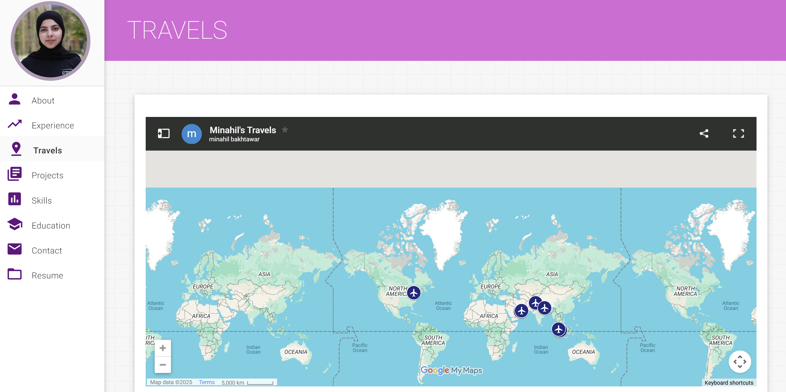
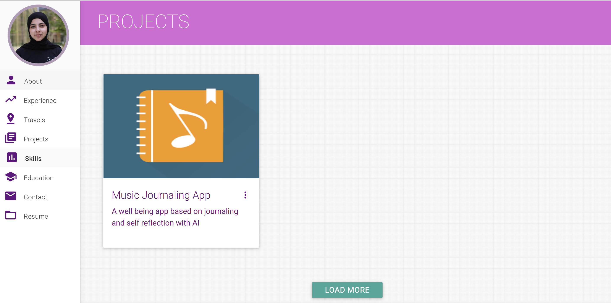

# Personal Portfolio ⚡️

This repo is a clone of:  
[https://github.com/varadbhogayata/varadbhogayata.github.io](https://github.com/varadbhogayata/varadbhogayata.github.io)

---

## Activity 1: Repo Cloned
Description: Cloned the original personal website repository.  

---

## Activity 2: Personal Details Updated
Description: Updated the website with my name, profile details, and personal information.  

---

## Activity 3: Color Theme Changed
Description: Customized the color scheme of the website to match my personal style.  

---

## Activity 4: Map Embedded
Description: Embedded a Google Map showing my travels in the “Travels” section.  

---

## Activity 5: Dynamic Project Loading
Description: Implemented JavaScript to dynamically display projects in the “Projects” section with a “Load More” button.  

